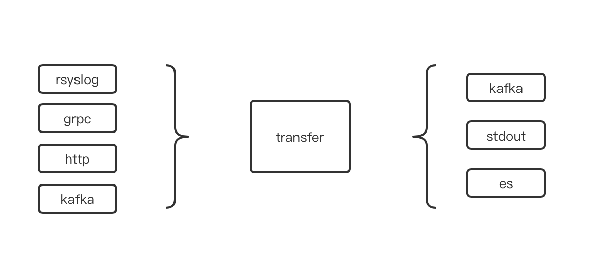
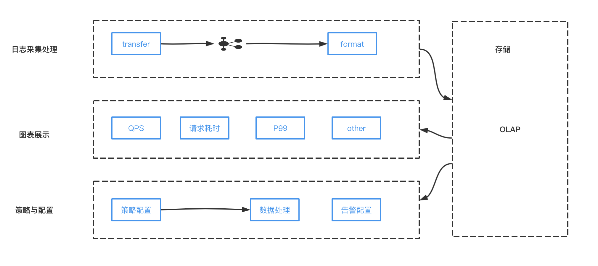
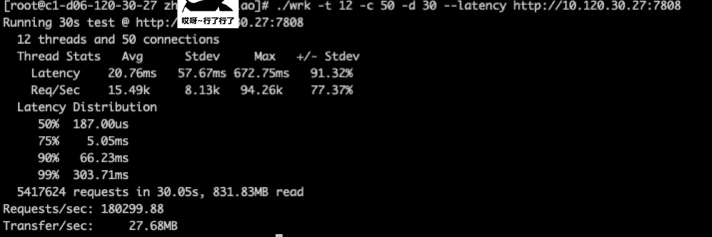
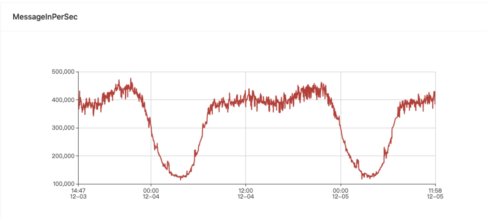

# log-transfer

Golang 日志转发 transfer

##

## 日志转发收集，支持代理层日志、业务日志、自定义日志，存储至 kafka、es



### 支持多种数据输入，传输格式:

```
http: POST {"tag":"aaxx","data":"log-info"}
grpc: &pb.Request{Tag: "aaxx", Msg: "log-info"}
nginx: access_log syslog:server=127.0.0.1:514,facility=local7,severity=debug,tag=aaxx syslog;
```

###

## 日志分析系统

---



## logtransfer 测试

---



# kafka 写入


